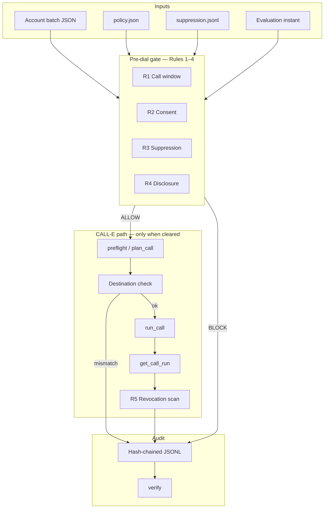

# Cleared to Call

**Tagline:** Your AI can place the call. This decides whether it is allowed to.

**A pre-dial compliance gate for AI collection calls.** Nothing dials unless the
policy clears it, and every refusal names the rule that caused it.

| | |
| --- | --- |
| **Live demo** | https://clearedtocall.vercel.app |
| **This repo** | https://github.com/Demiladepy/Cleared-to-call |
| **Agent Skill PR** | https://github.com/CALLE-AI/awesome-phone-call-agents/pull/574 |
| **Demo video** | `[YOUR_UNLISTED_YOUTUBE_URL]` |
| **Tests** | 277 passing |

The public demo is read-only: live calling is disabled on Vercel, so nothing
there can dial anyone. Local `--allow-live` is for your own authorized test
numbers only.

---

## Devpost submission (copy-paste)

Use this block when filling the hackathon form.

### Project name

Cleared to Call

### Tagline

Your AI can place the call. This decides whether it is allowed to.

### Elevator pitch

Cleared to Call is a pre-dial compliance gate for AI outbound collection calls.
Before CALL-E dials, four rules check the recipient's local call window, consent
on file, suppression list, and mandatory disclosure script. A fifth rule handles
live opt-out and permanently suppresses the number. Every allow or refuse
appends to a hash-chained audit log.

The public demo runs a batch of seven fictional accounts: three are refused with
named reasons before anything dials. The portable Agent Skill lives in the CALL-E
community repo; the Python implementation, tests, and demo live here.

### What it does (one sentence)

A pre-dial compliance gate for AI collection calls: it refuses a call with a named reason when a policy precondition fails, ends and suppresses on a live opt-out, and records every allow or refuse in a hash-chained decision log.

### Built with

- [CALL-E](https://github.com/CALLE-AI/awesome-phone-call-agents) (`plan_call`, `run_call`, `get_call_run`)
- Python 3.11, FastAPI, pytest
- Node.js 20+ (Agent Skill scripts, no npm dependencies)
- [Agent Skills](https://github.com/CALLE-AI/awesome-phone-call-agents/tree/main/skills) format (`skills/cleared-to-call/`)
- Deployed on [Vercel](https://clearedtocall.vercel.app)

### CALL-E account email

The address you used with `calle auth login`.

### Try it (judges, no login)

1. Open https://clearedtocall.vercel.app
2. See three refused rows (call window, no consent, suppression list) and four cleared
3. Switch the time preset: New York and Los Angeles flip opposite ways at the same instant
4. Expand **Technical details** on any row for the block code and audit ref
5. Scroll to **Audit chain** and confirm verification passes

---

## Inspiration

Outbound voice AI is racing ahead of the law. Platforms can place a call in
seconds; statutory collection rules were written for human dialers and carry
**$500–$1,500 per violation** under the TCPA, with FDCPA and Regulation F
layered on top. Operators are liable when the agent gets it wrong, not the
software vendor.

Three things pointed at the same gap:

1. **`skills/ledger-collections-call`** in the CALL-E repo lists consumer FDCPA
   / statutory debt-collection engines under **When Not To Use**. That is the
   missing layer: something that decides whether the call may happen at all.
2. **`apps/python/consent-gate`** (ConsentGate) covers adjacent pre-flight checks
   but excludes financial content by design. Collections need a gate built for
   that domain, with live revocation and a hash-chained decision record.
3. **CALL-E design principles** say never infer timezone from a phone number.
   The API has no `recipient_timezone` field on `plan_call`, so every integrator
   rebuilds the hardest part. This project makes that logic explicit, testable,
   and portable as an Agent Skill.

The goal is not another dialer. It is the precondition lenders need before they
let AI scale outbound collections.

---

## Architecture



**Three deliverables, one policy file:**

| Piece | Role |
| --- | --- |
| `skills/cleared-to-call/` | Portable Agent Skill (Node). Submitted upstream via PR #574. Never dials. |
| `cleared/` | Python gate, audit chain, suppression, batch runner, CALL-E caller. 277 tests. |
| `demo/` | FastAPI UI over a fixture batch. Shows every decision, refusal, transcript, audit entry. |

Node and Python gates read **the same `policy.json`**. `tests/test_skill_scripts.py`
runs both over the same fixtures and compares every verdict.

**Call flow when live:**

1. Gate evaluates rules 1–4 at the chosen instant (or real time for live dial).
2. On ALLOW, `plan_call` runs; destination is checked against the cleared number.
3. `run_call` → `get_call_run`; transcript is scanned for revocation (rule 5).
4. Opt-out suppresses the number permanently; audit line appended either way.

Dry run is the default everywhere. `--execute` and `--allow-live` require explicit
flags plus a logged-in CALL-E CLI.

---

## The problem

Automated collection calls are the highest-volume use case in outbound voice AI,
and the most legally exposed one. The rules are specific:

- call only between 08:00 and 21:00 **in the recipient's local time**
- call only with prior express consent on file
- never call a number on the opt-out or do-not-call list
- open with a mandatory identity and purpose disclosure
- honor "stop calling me" immediately, and permanently

When an AI agent gets any of that wrong, the **operator** is liable. Lenders who
would happily let AI dial often won't, because nothing in the stack proves the
call was allowed.

`cleared-to-call` refuses when the law says no, honors live opt-out, and leaves a
hash-chained record either way.

---

## The policy: five rules

Rules live in [`cleared/policy.json`](cleared/policy.json). Full citations:
[`skills/cleared-to-call/references/policy.md`](skills/cleared-to-call/references/policy.md).

| # | Rule | Check | On failure | Authority (summary) |
| --- | --- | --- | --- | --- |
| 1 | **Call window** | Local time 08:00–21:00 from stored IANA timezone | `OUTSIDE_CALL_WINDOW` | FDCPA 1692c(a)(1); Reg F 12 CFR 1006.6(b)(1)(i) |
| 2 | **Consent** | `consent_on_file` + parseable `consent_timestamp` | `NO_CONSENT` | TCPA 47 U.S.C. 227(b)(1)(A) |
| 3 | **Not suppressed** | Number not on opt-out / DNC list | `ON_SUPPRESSION_LIST` | TCPA 47 CFR 64.1200(d); FDCPA 1692c(c) |
| 4 | **Disclosure** | Script contains all required disclosure elements | `MISSING_DISCLOSURE` | FDCPA 1692e(11); TCPA 227(d)(3)(A) |
| 5 | **Revocation** | Live + post-call transcript scan; permanent suppression | outcome `opt_out` | TCPA 64.1200(a)(10); Reg F 1006.6(c) |

**Never guessed:** timezone comes from the account record only, not area code,
country code, locale, or server clock.

Temporal properties (specification, not model-checked):

```text
R1  G(dial -> local_time_within(08:00, 21:00))
R2  G(dial -> consent_on_file & consent_timestamp_present)
R3  G(suppressed(number) -> G(!dial(number)))
R4  G(dial -> script_contains(all disclosure_elements))
R5  G(revocation_detected -> F(end_call & suppressed(number)))
```

---

## What we learned building on CALL-E

Condensed feedback for the hackathon survey. The full write-up, with the live
evidence behind each finding, is in [`FEEDBACK.md`](FEEDBACK.md):

1. **`plan_call` has no timezone field** — integrators rebuild recipient-local-time logic; DST errors are liability.
2. **No structured opt-out on `get_call_run`** — `COMPLETED` looks the same whether the person opted out or paid.
3. **No platform suppression list** — each integration keeps its own DNC store.
4. **Consent is invisible to the platform** — nothing in the plan records why this number may be called.
5. **MCP vs REST payload shapes differ** — `structured_content` vs JSON in `content` broke our first live runs.
6. **`DECLINED` with zero duration** — carrier rejection reads like the callee hung up; dangerous for legal records.
7. **Transcript speaker labels are undocumented** — opt-out detection depends on knowing which label is the recipient.

---

## References and prior art

### Legal and regulatory (US federal collections)

| Source | Used for |
| --- | --- |
| [TCPA 47 U.S.C. 227](https://www.law.cornell.edu/uscode/text/47/227) | Consent, artificial voice disclosure, DNC |
| [FDCPA 15 U.S.C. 1692](https://www.law.cornell.edu/uscode/text/15/1692) | Call window, purpose disclosure, opt-out |
| [Regulation F, 12 CFR Part 1006](https://www.ecfr.gov/current/title-12/chapter-X/part-1006) | Time-of-day contact, revocation |
| [47 CFR 64.1200](https://www.ecfr.gov/current/title-47/chapter-I/subchapter-B/part-64/subpart-L/section-64.1200) | Telemarketing and DNC rules |

Not legal advice. Engineering encoding of widely documented requirements; operators
remain responsible for their compliance position.

### CALL-E ecosystem

| Resource | Role in this project |
| --- | --- |
| [awesome-phone-call-agents](https://github.com/CALLE-AI/awesome-phone-call-agents) | Host repo; Agent Skill contribution ([PR #574](https://github.com/CALLE-AI/awesome-phone-call-agents/pull/574)) |
| [skills/ledger-collections-call](https://github.com/CALLE-AI/awesome-phone-call-agents/tree/main/skills/ledger-collections-call) | Complementary collections skill; lists FDCPA engines under *When Not To Use* |
| [apps/python/consent-gate](https://github.com/CALLE-AI/awesome-phone-call-agents/tree/main/apps/python/consent-gate) | Adjacent prior art (pre-flight, non-financial scope) |
| [docs/design-principles.md](https://github.com/CALLE-AI/awesome-phone-call-agents/blob/main/docs/design-principles.md) | Timezone must not be inferred from number (principle we enforce in code) |
| [@call-e/cli](https://www.npmjs.com/package/@call-e/cli) | Auth and live call path |

### How this differs from ConsentGate

| | ConsentGate | Cleared to Call |
| --- | --- | --- |
| **Form** | Python app under `apps/python/` | Agent Skill under `skills/` + Python reference impl |
| **Domain** | Low-risk admin; excludes financial content | Consumer collections (TCPA / FDCPA / Reg F) |
| **Rule 5** | Pre-flight only | Live revocation + post-call transcript re-read |
| **Proof** | Redacted manifest | Append-only hash chain with verifier |
| **Portability** | Python required | Node skill runs standalone |

---

## Quickstart

Requires Python 3.11+ and Node 20+. No credentials, no credits, nothing dials.

```bash
python3 -m venv .venv
.venv/bin/pip install -e ".[demo,dev]"      # Windows: .venv\Scripts\pip
source .venv/bin/activate                   # Windows: .venv\Scripts\activate
```

Run the batch in dry run:

```bash
python -m cleared.cli run --now 2026-08-28T13:30:00Z --fresh
```

```text
ACCOUNT   DECISION REASON / OUTCOME       DISCLOSED  AUDIT
A-1001    ALLOW    promise_to_pay         yes        aud_26cff37a
A-1002    BLOCK    OUTSIDE_CALL_WINDOW    -          aud_8ce3400a
A-1003    BLOCK    NO_CONSENT             -          aud_02ab9627
A-1004    BLOCK    ON_SUPPRESSION_LIST    -          aud_e95ff827
A-1005    ALLOW    opt_out                yes        aud_98654e5a
A-1006    ALLOW    no_answer              -          aud_edfd6351
A-1007    ALLOW    dispute                yes        aud_80358dda

7 account(s): 3 blocked, 4 called, 1 opt-out(s).
Audit chain: verified (7 entries).
```

Other commands:

```bash
python -m cleared.cli evaluate --account-id A-1002
python -m cleared.cli verify
python -m cleared.cli policy
python -m demo.app --now 2026-08-28T13:30:00Z
python -m pytest
```

### The skill on its own

```bash
cd skills/cleared-to-call
node scripts/validate-input.mjs --file ../../fixtures/accounts.json
node scripts/evaluate-account.mjs --file ../../fixtures/accounts.json \
  --account-id A-1002 --now 2026-08-28T13:30:00Z
node scripts/check-revocation.mjs --utterance "stop calling me"
```

Exit codes: `0` allow, `2` block, `3` revocation detected, `1` unusable input.

---

## Placing real calls

Dry run is the default. Live calling needs `--execute` or `--allow-live`, a
logged-in CALL-E CLI, consent on file, and a number you are authorized to call.

```bash
npm install -g @call-e/cli
calle auth login
pip install -e ".[live]"

python -m cleared.cli preflight --account-id A-9001 --region IN
python -m cleared.cli run --execute --account-id A-9001 --region IN
```

India (`+91`, `Asia/Kolkata`, `--region IN`) is supported on CALL-E. The gate
policy is US federal; the recipient's timezone drives rule 1, not the country
code. See [`LIVE-TEST.md`](LIVE-TEST.md) and [`VIDEO-SHOOT.md`](VIDEO-SHOOT.md).

**Fixtures use fictional `555-01xx` numbers.** Real numbers belong only in
gitignored `fixtures/demo-live.json`.

---

## The audit record

One append-only JSONL line per decision. Each line hashes the previous:

```json
{"account_id":"A-1002","audit_ref":"aud_8ce3400a","block_reason":"OUTSIDE_CALL_WINDOW",
 "decision":"block","dry_run":true,"hash":"f1a1f08f...","outcome":"not_called",
 "phone_masked":"+1******1235","policy_id":"us-federal-collections","policy_version":"1.0.0",
 "prev_hash":"41f9160f...","provider_ref":null,
 "rules_evaluated":{"R1":"fail","R2":"pass","R3":"pass","R4":"pass"},
 "timestamp":"2026-08-28T13:30:00+00:00"}
```

Editing, deleting, or reordering entries breaks the chain; `verify` reports the
first bad index. Phone numbers in the log are always masked.

---

## Repository layout

```text
cleared/           gate, policy loader, audit chain, suppression, runner, CALL-E caller
  policy.json      the five rules, call window, disclosure elements
demo/              FastAPI view over a batch run
fixtures/          seven fictional accounts, seed suppression list
skills/cleared-to-call/
  SKILL.md         Agent Skill entry point
  references/      policy.md, safety.md, examples.md
  scripts/         self-contained Node gate
  assets/          policy.json (parity-checked against cleared/)
tests/             277 tests
```

---

## Scope and limits

- **One jurisdiction:** US federal (TCPA / FDCPA / Reg F) only.
- **Five rules:** no state caps, reassigned-number DB, or litigator lists.
- **Not a dialer, not legal advice, not a CRM integration.**
- **`ALLOW` is necessary, not sufficient.** Passing the declared policy is not proof a
  call is lawful or authorized; the operator remains responsible.
- **The hash chain detects edits, deletions and reordering** within a log. It does
  not stop someone replacing the entire log from genesis. That needs an external
  anchor for the head hash, which is out of scope.
- **Skill vs. package.** The upstream Agent Skill is offline advisory helpers: it
  evaluates records and flags opt-out phrases, and the host persists suppression
  and audit records. This repository's Python package is one such host, and is
  what implements the audit log, suppression writes and post-call checks. The
  maintainer's review of PR #574 drew that line precisely, and it is the right one.

---

## Submission checklist

| Item | Status |
| --- | --- |
| Code + tests (277) | Done |
| Live demo (Vercel) | Done |
| Agent Skill PR #574 | Open |
| Demo video | You: [`VIDEO-SHOOT.md`](VIDEO-SHOOT.md) |
| Devpost form | You: copy sections above |
| Feedback survey | You: submit [`FEEDBACK.md`](FEEDBACK.md) |

---

## License

MIT.
